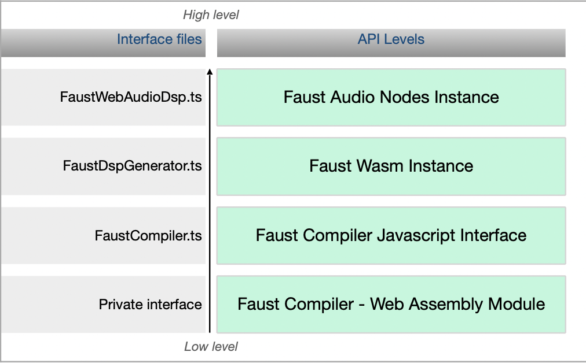

# FaustWasm

The Faust Web Audio library provides a high level Javascript API over the [Faust](https://faust.grame.fr) compiler. The interface is designed to be used with [TypeScript](https://www.typescriptlang.org/), but describes and documents the API for pure Javascript as well. The WebAssembly version of [Faust Compiler](https://github.com/grame-cncm/faust) is for [Node.js](https://nodejs.org) and web browsers, built with [Emscripten](https://emscripten.org/) 3.1.31.

## Usage

Please use a stable version of [Node.js](https://nodejs.org) 16+ to work with this project.

### Use the command line interface

Clone and get into this project:
```bash
git clone https://github.com/grame-cncm/faustwasm.git
cd faustwasm
```

Build the files:
```bash
npm run build
```

#### Generate WebAssembly version of a Faust DSP
For example:
```bash
rm -rf test/out # make sure you are under the faustwasm directory.
node scripts/faust2wasm.js test/mono.dsp test/out
```
or
```bash
rm -rf test/out # make sure you are under the faustwasm directory.
node scripts/faust2wasm.js test/poly.dsp test/out -poly
```
You can create standalone DSP on a web page using the same command line
```bash
rm -rf test/out # make sure you are under the faustwasm directory.
node scripts/faust2wasm.js test/rev.dsp test/out -standalone
```

#### Generate SVG Diagrams of a Faust DSP
For example:
```bash
rm -rf test/out # make sure you are under the faustwasm directory.
node scripts/faust2svg.js test/mono.dsp test/out
```
The main diagram should be in `test/out/process.svg`.

#### Generate or process audio files
Options:
- `-bs     <num>` to setup the rendering buffer size in frames (default: 64)
- `-bd     16|24|32` to setup the output file bit-depth (default: 16)
- `-c      <samples>` to setup the output file length in frames, when -ct is not used (default: SR*5)
- `-in     <inputWav.wav>` specify an input file to process
- `-sr     <num>` to setup the output file sample rate (default: 44100)
See this help:

```bash
node scripts/faust2sndfile.js -h
```

For example:
```bash
rm -rf test/out # make sure you are under the faustwasm directory.
mkdir test/out
node scripts/faust2sndfile.js test/p-dj.dsp test/out/p-dj.wav -c 192000 -sr 48000 -bd 24
```
Now the `test/out/p-dj.wav` should be generated.

```bash
node scripts/faust2sndfile.js test/rev.dsp test/out/p-dj-rev.wav -c 192000 -sr 48000 -bd 24 -in test/out/p-dj.wav
```

### Use the JavaScript Module

```bash
npm i -D @shren/faustwasm
```

In JavaScript:
```JavaScript
const FaustWasm = require("@shren/faustwasm");
const path = require("path");
const fs = require("fs");

const {
    instantiateFaustModuleFromFile,
    LibFaust,
    WavEncoder,
    FaustMonoDspGenerator,
    FaustCompiler,
    FaustSvgDiagrams
} = FaustWasm;

(async () => {
    const faustModulePath = path.join(__dirname, "../node_modules/@shren/faustwasm/ libfaust-wasm/libfaust-wasm.js");

    // initialize the libfaust wasm
    const faustModule = await instantiateFaustModuleFromFile(faustModulePath);

    // Get the Faust compiler
    const libFaust = new LibFaust(faustModule);
    console.log(libFaust.version());
    const compiler = new FaustCompiler(libFaust);
    const generator = new FaustMonoDspGenerator();
    const sampleRate = 48000;
    const name = "Djembe"
    const argv = ["-I", "libraries/"];
    const code = `
import("stdfaust.lib");
process = ba.pulsen(1, 10000) : pm.djembe(60, 0.3, 0.4, 1);
`;
    // Compile the DSP
    await generator.compile(compiler, name, code, argv.join(" "));
    const processor = await generator.createOfflineProcessor(sampleRate, 1024);

    // Generate SVG diagrams.
    const svgDiagrams = new FaustSvgDiagrams(compiler);
    const svgs = svgDiagrams.from(name, code, argv.join(" "));
    console.log(Object.keys(svgs));

    const out = processor.render(null, 192000);
    const wav = WavEncoder.encode(out, { sampleRate, bitDepth: 24 });

    // The wav file is generated
    fs.writeFileSync(`${__dirname}/out.wav`, new Uint8Array(wav));
})();
```

### Use in a web browser
```JavaScript

(async () => {
    const {
        instantiateFaustModuleFromFile,
        LibFaust,
        WavEncoder,
        FaustMonoDspGenerator,
        FaustCompiler,
        FaustSvgDiagrams
    } = await import("../node_modules/@shren/faustwasm/dist/esm/index.js");

    // initialize the libfaust wasm
    const faustModule = await instantiateFaustModuleFromFile("../node_modules/@shren/faustwasm/libfaust-wasm/libfaust-wasm.js");

    // Get the Faust compiler
    const libFaust = new LibFaust(faustModule);
    window.libFaust = libFaust;
    console.log(libFaust.version());
    const compiler = new FaustCompiler(libFaust);
    const generator = new FaustMonoDspGenerator();
    const sampleRate = 48000;
    const name = "Djembe"
    const argv = ["-I", "libraries/"];
    const code = `
import("stdfaust.lib");
process = ba.pulsen(1, 10000) : pm.djembe(60, 0.3, 0.4, 1);
`;
    // Compile the DSP
    await generator.compile(compiler, name, code, argv.join(" "));
    const processor = await generator.createOfflineProcessor(sampleRate, 1024);

    // Generate SVG diagrams.
    const svgDiagrams = new FaustSvgDiagrams(compiler);
    const svgs = svgDiagrams.from(name, code, argv.join(" "));
    console.log(Object.keys(svgs));

    const out = processor.render(null, 192000);
    const wav = WavEncoder.encode(out, { sampleRate, bitDepth: 24 });

    // The wav file is generated
    const blob = new Blob([wav], { type: "audio/wav" });
    const player = document.createElement("audio");
    player.controls = true;
    player.src = URL.createObjectURL(blob);
    document.body.appendChild(player);
    const svg = document.createElement("div");
    svg.innerHTML = svgs["process.svg"];
    document.body.appendChild(svg);
})();
```

## Documentation

-  [Organisation of the API](#org)

  - [Faust Compiler WebAssembly module](#module)
  - [Faust Compiler Javascript Interface](#compiler)
  - [Faust Wasm Instance](#wasm)
  - [Faust Audio Nodes Instances and Offline Processor ](#audio)
  - [High-level API](#high)
  - [How to use with typescript](#tsuse)
- [Dynamic and Static Instances](#ds)
- [Misc. services](#misc)
- [Important note](#note)


## Organisation of the API <a name="org"></a>

The API is organised from low to high level as illustrated by the figure below.



### Faust Compiler WebAssembly module <a name="module"></a>

The first level is the Faust compiler compiled as a wasm library named `libfaust-wasm`.
It consists in 3 different files:

- `libfaust-wasm.wasm` : the Faust compiler provided as a WebAssembly module 
- `libfaust-wasm.js` : a Javascript loader of the WebAssembly module
- `libfaust-wasm.data` : a virtual file system containing the Faust libraries.

The C++ code is compiled with [Emscripten](https://emscripten.org) and interfaced in `LibFaust.ts` and `types.ts`files. The loader will take care of providing an instance of the Faust WebAssembly module and of the associated virtual file system (libfaust-wasm.data).

### Faust Compiler Javascript Interface <a name="compiler"></a>

The Faust Compiler Javascript interface is described in `FaustCompiler.ts`.   
It provides *classic* Faust compilation services, which output is a raw WebAssembly module with an associated JSON description of the module.

### Faust Wasm Instance <a name="wasm"></a>

This level takes a WebAssembly module produced by the Faust compiler or a precompiled module loaded from a file, and builds an instance of this module with the proper Wasm memory layout, ready to run, but not yet connected to any audio node. It is described in `FaustDspGenerator.ts`, `FaustWasmInstantiator.ts`, `FaustWebAudioDsp.ts` and `FaustDspInstance.ts` files.   

### Faust Audio Nodes Instances and Offline Processor <a name="audio"></a>

This level takes a Faust Wasm instance to build an audio node. [AudioWorklet](https://developer.mozilla.org/fr/docs/Web/API/AudioWorklet) and [ScriptProcessor](https://developer.mozilla.org/en-US/docs/Web/API/ScriptProcessorNode) nodes are supported.  It is described in `FaustAudioWorkletNode.ts` and `FaustAudioWorkletProcessor.ts` files.   
  
**Warning**: AudioWorklet is a recent technology and may not be supported by all the browsers. Check the [compatibility](https://developer.mozilla.org/fr/docs/Web/API/AudioWorklet) chart.

Note that ScriptProcessor is marked as [deprecated](https://developer.mozilla.org/en-US/docs/Web/API/ScriptProcessorNode) but it's the only audio architecture available in older Safari versions. Both monophonic (generators, effects...) or polyphonic (instruments) nodes can be created. It is described in `FaustScriptProcessorNode.ts` file.

By default, and to save CPU, created audio nodes are not processing audio buffers. They have to be explicitely started with the `start` method (and possibly stopped if needed using the `stop`method).

An offline processor to render a DSP in a non real-time context and get the computed frames is available. It is described in `FaustOfflineProcessor.ts`. It will automatically use the `start` and `stop` methods internally to activate actual rendering in its `plot` method. 

### High-level API <a name="high"></a>

A high-level API is available to compile a DSP program and create the audio node, either monophonic or polyphonic using `createNode`. Offline processing monophonic or polyphonic nodes can be created using `createOfflineProcessor`. FFT processing nodes can be created using `createFFTNode`. It is described in `FaustDspGenerator.ts`. 

### How to use with typescript <a name="tsuse"></a>

Simply include the following to get access to types and functions:
~~~~~~~~~~~~~~~
///<reference types="@grame/libfaust"/>
~~~~~~~~~~~~~~~

## Dynamic and Static Instances <a name="ds"></a>

The Faust Wasm and Audio Node levels make it possible to generate instances from Faust dsp code as well as from pre-compiled WebAssembly modules.
In the latter case, it is not necessary to include the `libfaust-wasm.js` library, `index.js` is sufficient to provide the required services.
This allows to generate lighter and faster-loading HTML pages.

## Misc. services <a name="misc"></a>

- `FaustSvgDiagrams.ts`: provides facilities to browse Faust generated SVG diagrams
- `FaustFFTAudioWorkletProcessor`: provides FFT processing

## Important note <a name="note"></a>

Html pages embedding the Faust compiler must be served using https, unless using http://localhost.

----
<a href="http://faust.grame.fr"></a>


