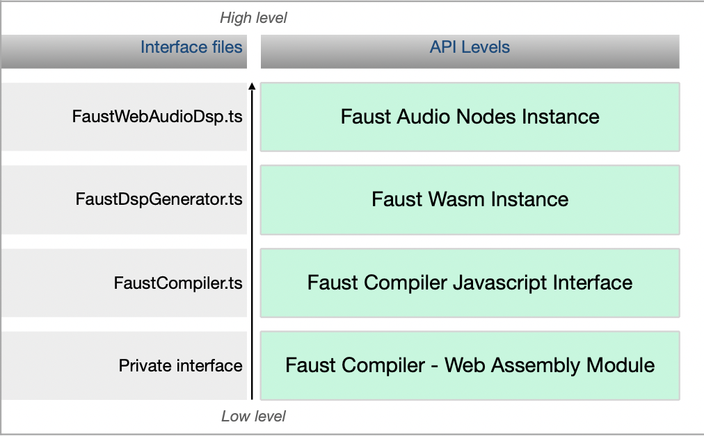

# FaustWasm

The FaustWasm library presents a convenient, high-level API that wraps around [Faust](https://faust.grame.fr) compiler. This library's interface is primarily designed for [TypeScript](https://www.typescriptlang.org/) usage, although it also provides API descriptions and documentation for pure JavaScript. The WebAssembly version of the Faust Compiler, compatible with both [Node.js](https://nodejs.org) and web browsers, has been compiled using [Emscripten](https://emscripten.org/) 6.0.3.

The library offers functionality for compiling Faust DSP code into WebAssembly, enabling its utilization as WebAudio nodes within a standard WebAudio node graph. Moreover, it supports offline rendering scenarios. Furthermore, supplementary tools can be employed for generating SVGs from Faust DSP programs.

Synthesizer and effect mono nodes, as well as [polyphonic](https://faustdoc.grame.fr/manual/midi/#midi-polyphony-support) poly nodes can be created. MIDI support is activated as soon as [MIDI metadata](https://faustdoc.grame.fr/manual/midi/#configuring-midi-in-faust) are used in the DSP code for mono nodes, and always in polyphonic mode. 
  
[Sensors](https://faustdoc.grame.fr/manual/syntax/#sensors-control-metadatas) (accelerometer and gyroscope) metadata are supported, as well as the [Progressive Web Application](https://en.wikipedia.org/wiki/Progressive_web_app) model.  

## Usage

Please use a stable version of [Node.js](https://nodejs.org) 16+ to work with this project.

### Use the command line interface

Clone and get into this project:
```bash
git clone https://github.com/grame-cncm/faustwasm.git
cd faustwasm
```

Install development dependencies:

```bash
npm install
```

Possibly:

```bash
npm update
```

Build the files:
```bash
npm run build
```

The source code uses [Prettier code formatter](https://prettier.io) to properly format all TS and JS files. Use:

```bash
npm run format
```

to apply format rules on `src`, and:

```bash
npm run lint
```

to check format rules on `src`. 

### Versioning

You'll have to raise the package version number in `package.json` before `npm run build` to properly work.

#### Generate WebAssembly version of a Faust DSP

For example:

```bash
rm -rf test/out # make sure you are under the faustwasm directory.
node scripts/faust2wasm.js test/mono.dsp test/out
```
will create a set of files: `index.js`, `create-node.js`, `dsp-module.wasm`, `dsp-meta.json`, `index.html` and the `faustwasm` folder in the `out` folder. The `-no-template` option omits everything but `dsp-module.wasm` and `dsp-meta.json`.

Polyphonic instrument with:

```bash
rm -rf test/out # make sure you are under the faustwasm directory.
node scripts/faust2wasm.js test/poly.dsp test/out -poly
```
will create a set of files: `index.js`, `create-node.js`, `dsp-module.wasm`, `dsp-meta.json`, `mixer-module.wasm`, `index.html` and the `faustwasm` folder (and, when the DSP source defines an `effect`, `effect-module.wasm` and `effect-meta.json`) in the `out` folder.

#### Local include files and `-I`

The CLI runs the Faust compiler inside a WebAssembly in-memory filesystem, so it cannot read your host filesystem directly. To make local `import("something.lib")` work:

- The directory that contains the input `.dsp` is automatically copied into the in-memory FS and added to the compiler include path.
- Any `-I <dir>` you pass is mirrored into the in-memory FS and added to the include path.
- Only `.dsp` and `.lib` files are mirrored.

This means you can run the CLI from any working directory as long as your local includes live next to the DSP or are listed with `-I`.

Example, using the `test/foo.dsp` and `test/includes/mylib.lib` fixtures that ship with the repository (`mylib.lib` deliberately does not sit next to `foo.dsp`, so the build only works with `-I`):

```bash
node scripts/faust2wasm.js -I test/includes test/foo.dsp test/out
```

#### Creating a Progressive Web Application (PWA) of a Faust DSP

You can create a standalone Progressive Web Application using the command line:

```bash
node scripts/faust2wasm.js test/rev.dsp test/rev -pwa
```
will create a set of files: `icon.png`, `service-worker.js`, `manifest.json`, `index.js`, `create-node.js`, `faust-pwa.js`, `dsp-module.wasm`, `dsp-meta.json`, `index.html`, and the `faustwasm`, `faust-ui` folders in the `rev` folder. 

The folder contains the necessary ressources to deploy the Faust application as a PWA on a server, to be installed and used offline. Note that audio files used by the `soundfile` primitives in the DSP code will have to be mannually added in the folder. 

A standalone polyphonic and MIDI standalone Progressive Web Application can be created with:

```bash
node scripts/faust2wasm.js test/organ1.dsp test/organ1 -poly -pwa
```
will create the same set of files, plus `mixer-module.wasm` and, since `organ1.dsp` defines an `effect`, `effect-module.wasm` and `effect-meta.json`, in the `organ1` folder.

#### Creating a standalone version of a Faust DSP, with audio and MIDI devices selector

You can create a standalone using the command line:

```bash
node scripts/faust2wasm.js test/rev.dsp test/rev -standalone
```
will create a set of files: `icon.png`, `service-worker.js`, `manifest.json`, `index.js`, `create-node.js`, `dsp-module.wasm`, `dsp-meta.json`, `index.html`, and the `faustwasm`, `faust-ui` folders in the `rev` folder. 

The folder contains the necessary ressources to deploy the Faust application as a PWA on a server, to be installed and used offline. Note that audio files used by the `soundfile` primitives in the DSP code will have to be mannually added in the folder. 

A standalone polyphonic and MIDI standalone Progressive Web Application can be created with:

```bash
node scripts/faust2wasm.js test/organ1.dsp test/organ1 -poly -standalone
```
will create the same set of files, plus `mixer-module.wasm` and, since `organ1.dsp` defines an `effect`, `effect-module.wasm` and `effect-meta.json`, in the `organ1` folder.

#### Generate SVG Diagrams of a Faust DSP

For example:
```bash
rm -rf test/out # make sure you are under the faustwasm directory.
node scripts/faust2svg.js test/mono.dsp test/out
```

The main diagram should be in `test/out/process.svg`.

#### Compile a Faust DSP in a Cmajor file

For example:
```bash
rm -rf test/out # make sure you are under the faustwasm directory.
node scripts/faust2cmajor.js test/organ.dsp test/out
```

The Cmajor file should be in `test/out/organ.cmajor`.

#### Generate or process audio files

Options:
- `-bs     <num>` to setup the rendering buffer size in frames (default: 64)
- `-bd     16|24|32` to setup the output file bit-depth (default: 16)
- `-c      <samples>` to setup the output file length in frames, when -ct is not used (default: SR*5)
- `-in     <inputWav.wav>` specify an input file to process
- `-sr     <num>` to setup the output file sample rate (default: 44100)
See this help:

```bash
node scripts/faust2sndfile.js -h
```

For example:
```bash
rm -rf test/out # make sure you are under the faustwasm directory.
node scripts/faust2sndfile.js test/djembe.dsp test/out/djembe.wav -c 192000 -sr 48000 -bd 24
```
Now the `test/out/djembe.wav` should be generated. Folders leading to the output file are created as needed.

The generated file can in turn be processed by another DSP with `-in`:

```bash
node scripts/faust2sndfile.js test/rev.dsp test/out/djembe-rev.wav -c 192000 -sr 48000 -bd 24 -in test/out/djembe.wav
```

### Use the JavaScript Module

```bash
npm i -D @grame/faustwasm
```

In JavaScript:
```JavaScript
const FaustWasm = require("@grame/faustwasm");
const path = require("path");
const fs = require("fs");

const {
    instantiateFaustModuleFromFile,
    LibFaust,
    WavEncoder,
    FaustMonoDspGenerator,
    FaustCompiler,
    FaustSvgDiagrams
} = FaustWasm;

(async () => {
    const faustModulePath = path.join(__dirname, "../node_modules/@grame/faustwasm/libfaust-wasm/libfaust-wasm.js");

    // initialize the libfaust wasm
    const faustModule = await instantiateFaustModuleFromFile(faustModulePath);

    // Get the Faust compiler
    const libFaust = new LibFaust(faustModule);
    console.log(libFaust.version());
    const compiler = new FaustCompiler(libFaust);
    const generator = new FaustMonoDspGenerator();
    const sampleRate = 48000;
    const name = "Djembe"
    const argv = ["-I", "libraries/"];
    const code = `
import("stdfaust.lib");
process = ba.pulsen(1, 10000) : pm.djembe(60, 0.3, 0.4, 1);
`;
    // Compile the DSP
    await generator.compile(compiler, name, code, argv.join(" "));
    const processor = await generator.createOfflineProcessor(sampleRate, 1024);

    // Generate SVG diagrams.
    const svgDiagrams = new FaustSvgDiagrams(compiler);
    const svgs = svgDiagrams.from(name, code, argv.join(" "));
    console.log(Object.keys(svgs));

    const out = processor.render(null, 192000);
    const wav = WavEncoder.encode(out, { sampleRate, bitDepth: 24 });

    // The wav file is generated
    fs.writeFileSync(`${__dirname}/out.wav`, new Uint8Array(wav));
})();
```

### Use in a web browser

```JavaScript

(async () => {
    const {
        instantiateFaustModuleFromFile,
        LibFaust,
        WavEncoder,
        FaustMonoDspGenerator,
        FaustCompiler,
        FaustSvgDiagrams
    } = await import("../node_modules/@grame/faustwasm/dist/esm/index.js");

    // initialize the libfaust wasm
    const faustModule = await instantiateFaustModuleFromFile("../node_modules/@grame/faustwasm/libfaust-wasm/libfaust-wasm.js");

    // Get the Faust compiler
    const libFaust = new LibFaust(faustModule);
    window.libFaust = libFaust;
    console.log(libFaust.version());
    const compiler = new FaustCompiler(libFaust);
    const generator = new FaustMonoDspGenerator();
    const sampleRate = 48000;
    const name = "Djembe"
    const argv = ["-I", "libraries/"];
    const code = `
import("stdfaust.lib");
process = ba.pulsen(1, 10000) : pm.djembe(60, 0.3, 0.4, 1);
`;
    // Compile the DSP
    await generator.compile(compiler, name, code, argv.join(" "));
    const processor = await generator.createOfflineProcessor(sampleRate, 1024);

    // Generate SVG diagrams.
    const svgDiagrams = new FaustSvgDiagrams(compiler);
    const svgs = svgDiagrams.from(name, code, argv.join(" "));
    console.log(Object.keys(svgs));

    const out = processor.render(null, 192000);
    const wav = WavEncoder.encode(out, { sampleRate, bitDepth: 24 });

    // The wav file is generated
    const blob = new Blob([wav], { type: "audio/wav" });
    const player = document.createElement("audio");
    player.controls = true;
    player.src = URL.createObjectURL(blob);
    document.body.appendChild(player);
    const svg = document.createElement("div");
    svg.innerHTML = svgs["process.svg"];
    document.body.appendChild(svg);
})();
```

### Sample-accurate scheduling

Every control method on a Faust AudioWorklet node takes an optional `time` argument as its last parameter: `setParamValue(path, value, time)`, `keyOn(channel, pitch, velocity, time)`, `keyOff(channel, pitch, velocity, time)`, `midiMessage(data, time)`, `ctrlChange(channel, ctrl, value, time)`, `pitchWheel(channel, wheel, time)`. `time` is in AudioContext seconds — the same clock as `audioCtx.currentTime` and `AudioParam.setValueAtTime` — and the action lands on the exact sample that instant names, inside the audio block that contains it. The unit is the second (a JavaScript double), the granularity is the sample: the processor converts it with `Math.round(time * sampleRate)` to a frame on the audio clock, so an instant is honoured to the nearest sample (about 21 µs at 48 kHz):

```JavaScript
const t0 = audioCtx.currentTime + 0.1;

// A parameter change on the exact sample
node.setParamValue("/mydsp/gate", 1, t0);
node.setParamValue("/mydsp/gate", 0, t0 + 0.05);

// A polyphonic pattern scheduled ahead of time
node.keyOn(0, 60, 100, t0);
node.keyOff(0, 60, 0, t0 + 0.5);
node.keyOn(0, 63, 100, t0 + 0.25);
```

Regular `AudioParam` automation on the node's parameters (`setValueAtTime`, `linearRampToValueAtTime`, ...) is followed sample-accurately as well, so a note and a parameter ramp can be scheduled against one another. Timestamps carried by Web Audio Modules (WAM) events are honoured the same way.

Left out, `time` behaves as before: the message is applied on arrival, at the start of the next audio block. A `time` already in the past is applied as soon as possible, in order. Notes:

- the FFT processor honours `time` at block granularity rather than sample granularity;
- ScriptProcessor nodes (`sp: true`) accept the argument and apply the message on arrival;
- `setParamValue` with a negative `time` throws (it is refused by `AudioParam.setValueAtTime`).

The page `test/web/poly-schedule.html` demonstrates the API, and `test/timing/measure.mjs` measures the sample accuracy (see below).

### Running the tests

Unit tests live in `test/unit` and run in plain Node (no browser needed). This builds the ESM bundle first, then runs every `*.test.mjs` file with Node's built-in test runner:

```bash
npm test
```

A timing measurement lives in `test/timing/measure.mjs`: it renders MIDI notes and parameter changes through a real AudioWorklet in headless Chromium and checks that each one lands on the exact sample it was scheduled for. It needs [Playwright](https://playwright.dev), which is deliberately not a dependency of this package:

```bash
npm i --no-save playwright
npx playwright install chromium
npm run measure
```

CLI tests live in `test/cli` and run the scripts in `scripts/` as real processes, checking what they leave on disk. They cover every output mode of `faust2wasm.js` (default template, `-no-template`, `-standalone`, `-pwa`, each with and without `-poly`), every `.dsp` file in `test/` -- each one compiled, then loaded back from the generated `dsp-module.wasm` and `dsp-meta.json` and rendered offline -- and the edge cases: `-I` include handling, argument parsing, failure modes, and concurrent invocations. `faust2svg`, `faust2cmajor` and `faust2sndfile` are covered too, the latter by reading `-sr`, `-bd` and `-c` back out of the generated WAV header. They need no browser:

```bash
npm run test-cli
```

`npm run test-all` runs the unit tests and the CLI tests together. Both write under `test/out`, which is gitignored and removed once the suite passes; a failing run leaves it in place so the output can be inspected. The CLI tests take a few seconds.

`test/web` contains interactive test pages to be checked by hand in a browser: mono and polyphonic instruments, FFT processors, soundfiles, and the `createFaustNode` API. Build the package, serve the repo root (so `dist/` and `libfaust-wasm/` are reachable), then open a page such as [http://localhost:8000/test/web/mono.html](http://localhost:8000/test/web/mono.html):

```bash
npm run build
python3 -m http.server 8000
```

### Projects examples

Several examples can be tested by launching a local web server at the faustwasm root level, and going in `test/faustlive-wasm` and `libfaust-in-worklet` folders.

The package is used in the following projects:

- [faust-web-component](https://github.com/grame-cncm/faust-web-component), a package providing two web components for embedding interactive Faust snippets in web pages.
- [Faust Playground](https://github.com/grame-cncm/faustplayground), a Web platform designed to enable children to learn basic audio programming in a simple and graphic way. 
- [Faust Editor](https://github.com/grame-cncm/fausteditor), a simple online editor used to edit, compile and run Faust code from any recent Web Browser with WebAssembly support. 
- [Faust Web IDE](https://github.com/grame-cncm/faustide), a more powerfull editor used to edit, compile and run Faust code from any recent Web Browser with WebAssembly support. 
- [Testing the embedded dynamic Faust compiler](https://fausteditor.grame.fr/faustlive-wasm.html) page allows to test the compiler, with this [HTML source code](https://github.com/grame-cncm/fausteditor/blob/master/faustlive-wasm.html) using [this JavaScript code](https://github.com/grame-cncm/fausteditor/blob/master/src/faustlive-wasm.js).

## Documentation

-  [Organisation of the API](#org)

  - [Faust Compiler WebAssembly module](#module)
  - [Faust Compiler Javascript Interface](#compiler)
  - [Faust Wasm Instance](#wasm)
  - [Faust Audio Nodes Instances and Offline Processor ](#audio)
  - [High-level API](#high)
  - [How to use with typescript](#tsuse)
- [Dynamic and Static Instances](#ds)
- [Misc. services](#misc)
- [Important note](#note)

### Organisation of the API <a name="org"></a>

The API is organised from low to high level as illustrated by the figure below.



#### Faust Compiler WebAssembly module <a name="module"></a>

The first level is the Faust compiler compiled as a wasm library named `libfaust-wasm`.
It consists in 3 different files:

- `libfaust-wasm.wasm` : the Faust compiler provided as a WebAssembly module 
- `libfaust-wasm.js` : a Javascript loader of the WebAssembly module
- `libfaust-wasm.data` : a virtual file system containing the Faust libraries.

The C++ code is compiled with [Emscripten](https://emscripten.org) and interfaced in `LibFaust.ts` and `types.ts`files. The loader will take care of providing an instance of the Faust WebAssembly module and of the associated virtual file system (libfaust-wasm.data).

### Faust Compiler Javascript Interface <a name="compiler"></a>

The Faust Compiler Javascript interface is described in `FaustCompiler.ts`.   
It provides *classic* Faust compilation services, which output is a raw WebAssembly module with an associated JSON description of the module.

### Faust Wasm Instance <a name="wasm"></a>

This level takes a WebAssembly module produced by the Faust compiler or a precompiled module loaded from a file, and builds an instance of this module with the proper Wasm memory layout, ready to run. It is described in `FaustDspGenerator.ts`, `FaustWasmInstantiator.ts`, `FaustWebAudioDsp.ts` and `FaustDspInstance.ts` files.   

#### Faust Audio Nodes Instances and Offline Processor <a name="audio"></a>

This level takes a Faust Wasm instance to build an audio node. [AudioWorklet](https://developer.mozilla.org/fr/docs/Web/API/AudioWorklet) and [ScriptProcessor](https://developer.mozilla.org/en-US/docs/Web/API/ScriptProcessorNode) nodes are supported. It is described in `FaustAudioWorkletNode.ts` and `FaustAudioWorkletProcessor.ts` files.   
  
**Warning**: AudioWorklet is a recent technology and may not be supported by all the browsers. Check the [compatibility](https://developer.mozilla.org/fr/docs/Web/API/AudioWorklet) chart.

The base audio node API documentation is documented in the [IFaustBaseWebAudioDsp](https://github.com/search?q=repo%3Agrame-cncm%2Ffaustwasm%20IFaustBaseWebAudioDsp&type=code) interface. The [IFaustPolyWebAudioDsp](https://github.com/search?q=repo%3Agrame-cncm%2Ffaustwasm%20IFaustPolyWebAudioDsp&type=code) interface documents the polyphonic extension.  

Note that ScriptProcessor is marked as [deprecated](https://developer.mozilla.org/en-US/docs/Web/API/ScriptProcessorNode) but it's the only audio architecture available in older Safari versions. Both monophonic (generators, effects...) or polyphonic (instruments) nodes can be created. It is described in `FaustScriptProcessorNode.ts` file.

Created audio nodes have a `start` and `stop` methods. When started (which is done by default), they are processing audio buffers. You may have to explicitly stop them to save CPU (and start then again when needed), if for instance several nodes are created at init time before actual use. 

An offline processor to render a DSP in a non real-time context and get the computed frames is available. It is described in `FaustOfflineProcessor.ts`. It will automatically use the `start` and `stop` methods internally to activate actual rendering in its `plot` method. 

#### High-level API <a name="high"></a>

The high-level API provides convenient functions to compile a Faust DSP program and create its corresponding audio node, either monophonic or polyphonic.
- using the appropriate `FaustMonoDspGenerator` or `FaustPolyDspGenerator` class, `createNode` explicitly builds a mono or polyphonic node.
- `createFaustNode` automatically selects mono or polyphonic mode by inspecting the `[nvoices:N] `field in the DSP metadata.

For offline rendering, `createOfflineProcessor` is available and supports both mono and polyphonic processing. FFT processing nodes can be created using `createFFTNode`.

This API is implemented in FaustDspGenerator.ts.

#### How to use with typescript <a name="tsuse"></a>

Simply include the following to get access to types and functions:
~~~~~~~~~~~~~~~
///<reference types="@grame/faustwasm"/>
~~~~~~~~~~~~~~~

### Dynamic and Static Instances <a name="ds"></a>

The Faust Wasm and Audio Node levels make it possible to generate instances from Faust dsp code as well as from pre-compiled WebAssembly modules.
In the latter case, it is not necessary to include the `libfaust-wasm.js` library, `index.js` is sufficient to provide the required services.
This allows to generate lighter and faster-loading HTML pages.

## Misc. services <a name="misc"></a>

- `FaustSvgDiagrams.ts`: provides facilities to browse Faust generated SVG diagrams
- `FaustFFTAudioWorkletProcessor`: provides FFT processing

### Important note <a name="note"></a>

Html pages embedding the Faust compiler must be served using https, unless using http://localhost.

----
<a href="http://faust.grame.fr"></a>
